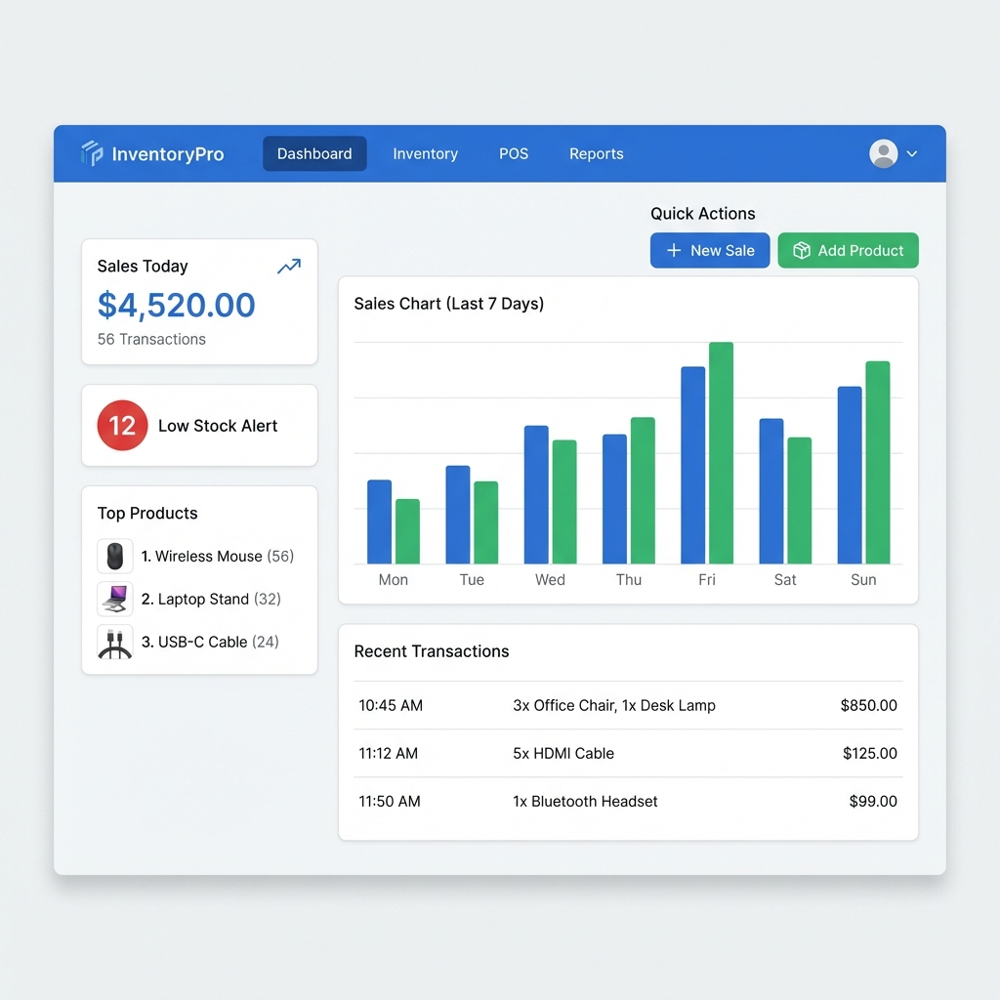
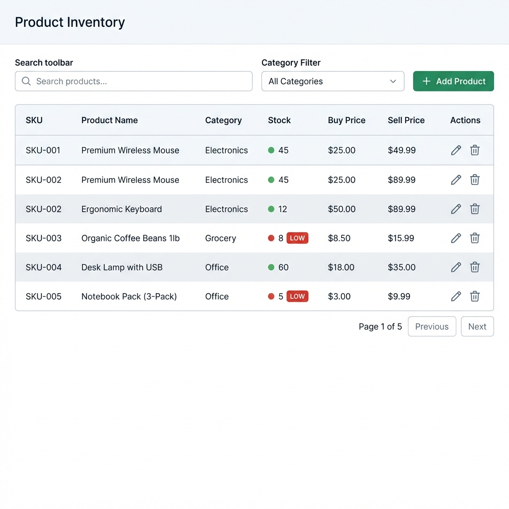
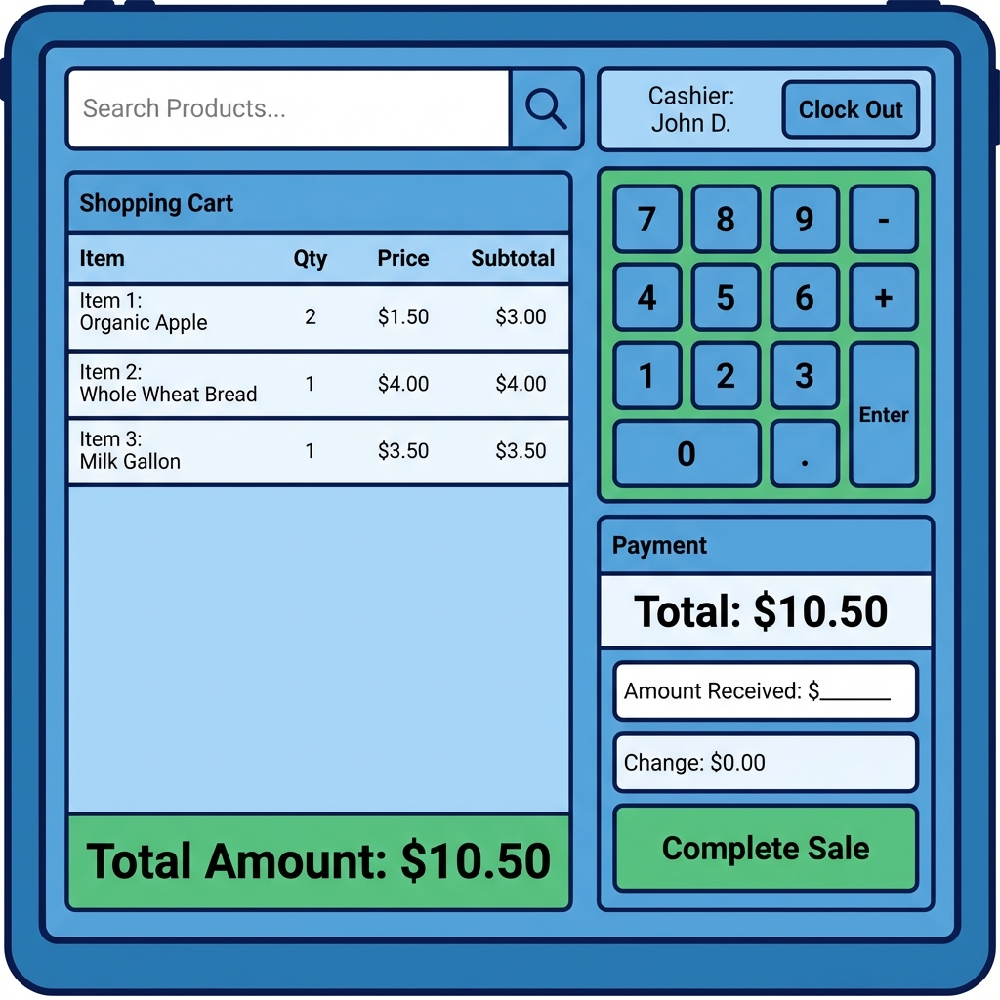
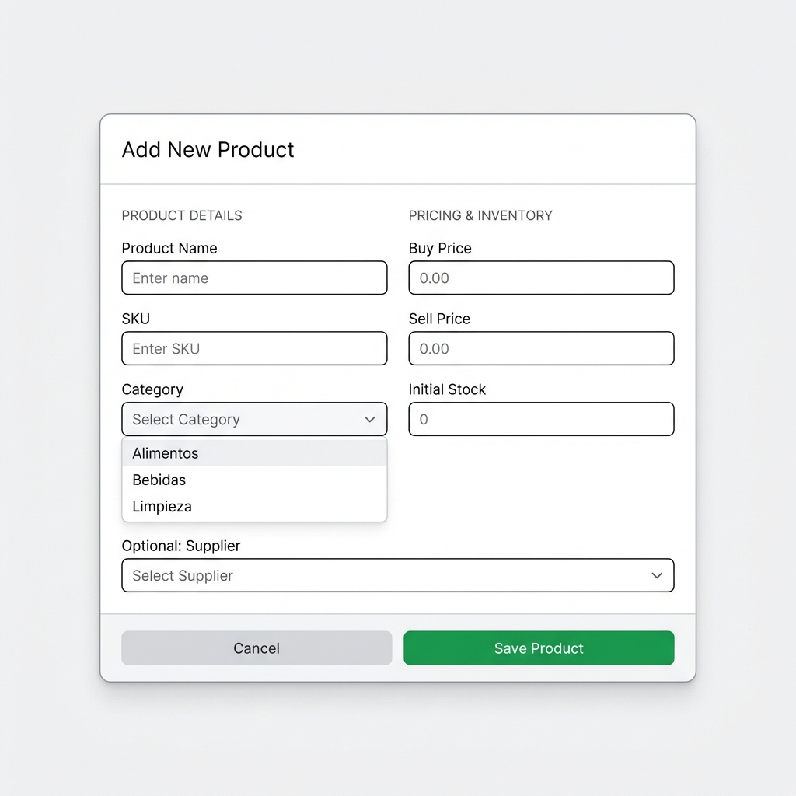

# Wireframes - MVP #1: Sistema de Inventario + POS

Visual mockups de los flujos principales de usuario.

---

## 1. Dashboard (Owner View)



**Components**:
- **Top Navigation**: Logo, menu items (Dashboard, Inventory, POS, Reports), user avatar
- **Left Sidebar Stats**:
  - "Sales Today" card ($4,520.00, 56 transactions)
  - "Low Stock Alert" badge (12 products)
  - "Top Products" list (top 3 sellers)
- **Main Content**:
  - Sales chart (bar chart, last 7 days)
  - Recent transactions table (time, items, total)
  - Quick Actions: "New Sale" (blue), "Add Product" (green)

**Key Metrics Displayed**:
- Daily sales total
- Transaction count
- Low stock alerts
- Top selling products

---

## 2. Product Inventory List



**Features**:
- **Top Toolbar**:
  - Search bar (search by name/SKU)
  - Category filter dropdown (All, Electronics, Grocery, Office, etc.)
  - "Add Product" button (green)
- **Data Table**:
  - Columns: SKU, Product Name, Category, Stock, Buy Price, Sell Price, Actions
  - Color-coded stock indicators:
    - 🟢 Green dot: Healthy stock (>10)
    - 🔴 Red badge "LOW": Low stock (≤10)
  - Actions: Edit (pencil icon), Delete (trash icon)
- **Pagination**: Page 1 of 5, Previous/Next buttons

**Interactions**:
- Click "Add Product" → Opens Add Product modal
- Click Edit → Opens edit modal with prefilled data
- Click Delete → Confirmation dialog
- Search/Filter → Table updates in real-time

---

## 3. POS (Point of Sale) Interface



**Layout**:

### Left Panel (60% width):
- **Search Bar**: "Search Products..." with autocomplete
- **Shopping Cart**:
  - Table: Item, Qty, Price, Subtotal
  - Shows current cart items (3 items in example)
  - Total Amount displayed prominently at bottom ($10.50)

### Right Panel (40% width):
- **User Info**: Cashier name, "Clock Out" button
- **Numeric Keypad**: 0-9, operators (+, -, .), Enter
- **Payment Section**:
  - Total (large text)
  - "Amount Received" input
  - "Change" calculated automatically
  - "Complete Sale" button (large, green)

**Workflow**:
1. Search product → Add to cart
2. Adjust quantity using keypad
3. Enter amount received
4. System calculates change
5. Click "Complete Sale"
6. Print receipt

---

## 4. Add Product Modal



**Form Layout** (2 columns):

### Left Column - Product Details:
- **Product Name**: Text input
- **SKU**: Text input (unique)
- **Category**: Dropdown (Alimentos, Bebidas, Limpieza)

### Right Column - Pricing & Inventory:
- **Buy Price**: Number input (decimal)
- **Sell Price**: Number input (decimal)
- **Initial Stock**: Number input (integer)

### Bottom:
- **Supplier** (optional): Dropdown

### Footer:
- "Cancel" button (gray)
- "Save Product" button (green)

**Validation**:
- SKU must be unique
- Sell price > Buy price (warning, not blocker)
- Stock ≥ 0

---

## Key User Flows

### Flow 1: Process a Sale (Cashier)
```
POS → Search Product → Add to Cart → Enter Amount → Complete Sale → Print Receipt
```

### Flow 2: Add New Product (Owner)
```
Inventory → Add Product → Fill Form → Save → Product appears in list
```

### Flow 3: Restock Low Inventory (Owner)
```
Dashboard → Low Stock Alert → Click product → Edit → Update stock → Save
```

---

## Responsive Behavior

### Desktop (>1024px):
- Full dual-panel layout for POS
- Sidebar visible on Dashboard

### Tablet (768-1024px):
- POS: Stack panels vertically
- Dashboard: Sidebar collapses to hamburger

### Mobile (<768px):
- POS: Single column, numeric keypad toggleable
- Inventory: Card view instead of table
- Forms: Single column

---

## Accessibility Notes

- All buttons keyboard-accessible (Tab navigation)
- Color-coding supplemented with text labels ("LOW" badge)
- Focus indicators on all inputs
- Screen reader labels for icon-only buttons
- High contrast mode support

---

## Design System References

- **Colors**: Green (success, add actions), Blue (primary, info), Red (alerts, low stock)
- **Typography**: Inter (UI), Outfit (headings)
- **Spacing**: 8px grid
- **Components**: shadcn/ui base

---

**Last Updated**: 2026-01-13  
**MVP**: #1 - Sistema de Inventario + POS
